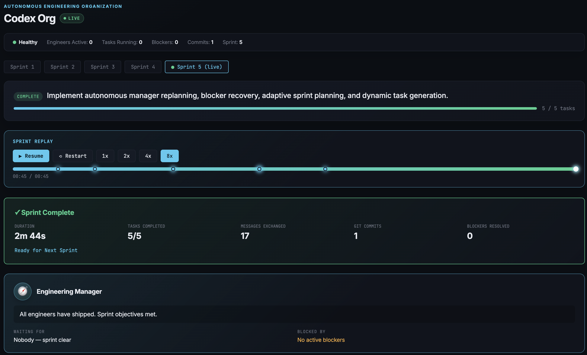
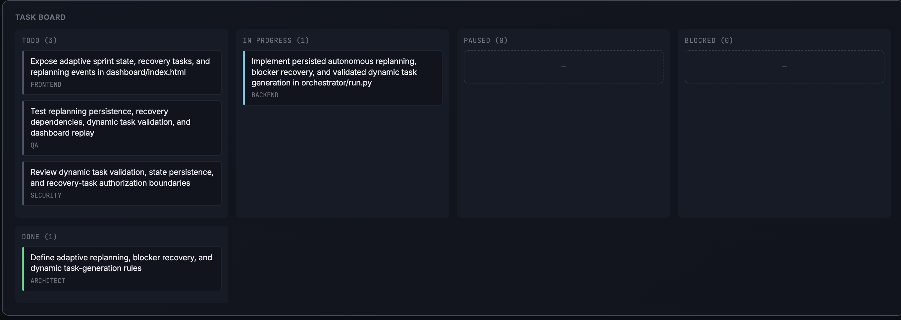

# Codex Org

> A small, observable multi-agent software engineering organization powered by Codex.

Codex Org turns a sprint goal into a dependency-aware plan, coordinates role-specific agents through implementation and review, records the work in Git, and replays the sprint in a live dashboard. It is a local, inspectable reference project: state, decisions, messages, blockers, usage, and sprint history are all durable files.

## Overview

Each sprint has one planning phase followed by execution, QA/security review, and a retrospective. Agents share durable sprint state instead of opaque conversation history. The dashboard renders both the current sprint and archived sprints, including tasks, communication, blockers, Git Activity, and deterministic replay events.

The repository includes a lightweight Kanban application as a demo delivery target, while the orchestration layer remains easy to inspect and adapt.

## Features

- Role-based management, architecture, database, backend, frontend, QA, and security agents
- Frozen, dependency-ordered sprint plans
- Scope-aware deterministic mock planning for demos and tests
- Durable sprint history with messages, blockers, task transitions, commits, and retrospectives
- Per-commit metadata for accurate historical inspection
- Deterministic sprint replay with task, message, blocker, and commit progression
- Interactive replay controls: play/pause, restart, scrubbing, markers, speed controls, and keyboard seeking
- Atomic state and commit-history writes with corruption-safe loading
- Orchestrator locking to prevent concurrent state mutation
- A dependency-free authenticated Kanban API and static UI

## Architecture

```text
Sprint goal
    │
    ▼
orchestrator/run.py ─────► agents/roles/*.md
    │                           │
    │                           ▼
    ├──── durable state ───► state/state.json
    ├──── commit metadata ─► logs/commits.json
    ├──── usage telemetry ─► logs/usage_log.jsonl
    │
    ▼
dashboard/index.html ◄──── sprint history + replay events
```

The orchestrator owns the lifecycle: it loads shared state, plans a sprint once, dispatches ready tasks in dependency order, persists every transition, records agent commits, and finishes with a retrospective. The dashboard is read-only and polls persisted state and commit history.

## Screenshots


```md

```


```md

```

## Replay Engine

The replay engine builds a deterministic timeline from archived sprint data:

- Task events reveal Todo → In Progress → Done transitions.
- Agent messages, blockers, and commits appear in recorded order.
- Same-second events use stable type and content ordering.
- Commit, message, blocker, and completion markers appear on the timeline.
- Replay supports dragging, hover previews, 1x/2x/4x/8x speeds, and keyboard controls (`Space`, `←`, `→`, with `Shift` for larger seeks).

Archived replay always reads from `sprint_history`, not from current live sprint state.

## Multi-agent orchestration

Role prompts in [`agents/roles`](agents/roles) provide bounded responsibilities:

| Role | Responsibility |
| --- | --- |
| Engineering Manager | Plans, coordinates dependencies, handles blockers, and writes the retrospective |
| Architect | Defines technical direction and closes planning gaps |
| Database | Owns persistence and schema work |
| Backend | Owns service and API implementation |
| Frontend | Owns UI implementation |
| QA | Validates behavior and regressions |
| Security | Reviews authentication, authorization, and input handling |

Agent output follows [`state/schemas/agent_turn.json`](state/schemas/agent_turn.json), allowing the orchestrator to validate and persist task updates, messages, decisions, blockers, and changed-file declarations.

## Sprint planning

Planning is finite. The manager creates the initial dependency graph, the architect can add only missing planning tasks, and the plan is then frozen for that sprint. During execution, the manager coordinates existing work rather than expanding scope.

Mock mode infers the smallest practical set of disciplines from the sprint goal. For example, authentication work uses architecture, data, backend, frontend, QA, and security; a focused UI bug fix uses frontend and QA.

## Installation

### Prerequisites

- Python 3.11 or newer
- Git
- [Codex CLI](https://platform.openai.com/docs/codex) only for real agent runs

```bash
git clone <your-fork-or-repository-url>
cd codex-org
```

The demo application uses the Python standard library; no third-party Python packages are required. For real agent runs, install and authenticate the Codex CLI using your preferred setup.

## Running locally

Run the deterministic mock sprint (default; no Codex usage):

```bash
CODEX_ORG_MOCK=1 python3 orchestrator/run.py
```

Run with real Codex agents:

```bash
CODEX_ORG_MOCK=0 python3 orchestrator/run.py
```

Start a new sprint with a goal:

```bash
CODEX_ORG_MOCK=1 python3 orchestrator/run.py "Add task search, filtering, and sorting"
```

Serve the dashboard from the repository root, then open `http://localhost:8080/dashboard/`:

```bash
python3 -m http.server 8080
```

Run the demo Kanban application:

```bash
export KANBAN_JWT_SECRET='replace-with-a-secret-at-least-32-bytes-long'
python3 server.py
```

Run tests:

```bash
python3 -m unittest discover -v
```

## Project structure

```text
agents/roles/          Role prompts and responsibilities
dashboard/             Sprint dashboard and replay UI
orchestrator/run.py    Sprint lifecycle, planning, persistence, and Git integration
state/                 Shared state and agent-output schema
logs/                  Commit metadata, agent outputs, session ID, and usage logs
static/                Demo Kanban web client
server.py              Demo Kanban HTTP API and static server
database.py            SQLite schema and connection management
test_api.py            API and security regression tests
test_mock_planner.py   Orchestration, replay, and persistence regression tests
```

## Demo GIF

> Placeholder — add a walkthrough at `docs/images/codex-org-demo.gif`.

```md

```

## Roadmap

- Add packaged CLI commands for common sprint and dashboard workflows
- Add export/import support for archived sprint histories
- Add richer replay filtering by agent and event type
- Add a documented plugin and role extension guide
- Add visual assets and a recorded end-to-end demo

## Known limitations

- The dashboard is a local, read-only view of JSON files, not a multi-user collaboration service.
- A hard process termination can leave the orchestrator lock file behind and requires manual cleanup.
- Agent file declarations isolate commits at the file level; concurrent user edits in the same declared file cannot be separated automatically.
- Real runs require a configured Codex CLI and can consume model usage.
- Historical commit metadata created before the metadata format was introduced may be limited.

## Future improvements

- Use an isolated Git index or worktree per agent turn for hunk-level commit isolation
- Make cross-file retrospective completion fully idempotent after partial failures
- Add stale-lock detection and recovery
- Add a durable event log for richer audit and replay recovery
- Add browser-level integration tests for dashboard interactions

## License

No license file is currently included. Add a license, such as MIT or Apache-2.0, before distributing this project as open source.
